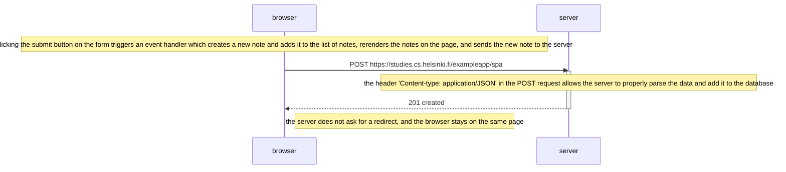

```mermaid
sequenceDiagram
    participant browser
    participant server

    note over browser: clicking the submit button on the form triggers an event handler which creates a new note and adds it to the list of notes, rerenders the notes on the page, and sends the new note to the server

    browser->>server: POST https://studies.cs.helsinki.fi/exampleapp/spa
    activate server

    note over server: the header 'Content-type: application/JSON' in the POST request allows the server to properly parse the data and add it to the database
    server-->>browser: 201 created  
    deactivate server

    Note right of browser: the server does not ask for a redirect, and the browser stays on the same page
```
